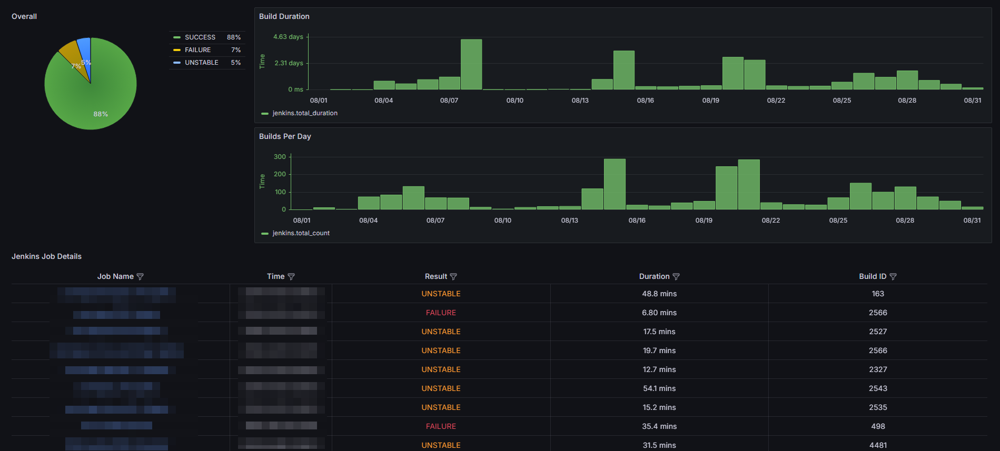

# Jenkins Collector Deployment

This document outlines the steps to build, tag, push, and run the Jenkins Collector Docker container in a secure and controlled manner.

## Prerequisites

- Docker installed on your machine.
- Access to a Docker registry (e.g., Docker Hub, JFrog, etc.).
- Jenkins and InfluxDB credentials securely stored.

## Quick Start with Docker Hub

You can pull and run the Jenkins Collector Docker image directly from Docker Hub:

### 1. Pull the Docker Image from Docker Hub

```bash
docker pull ynixon/jenkins-collector:latest
```

### 2. Run the Docker Container

Run the container with the necessary environment variables. **Ensure sensitive information like credentials and tokens are securely managed.**

```bash
docker run --name jenkins-collector -d \
--restart unless-stopped \
-e JENKINS_URL='<your_jenkins_url>' \
-e JENKINS_USER='<your_jenkins_user>' \
-e JENKINS_PASSWORD='<your_jenkins_password>' \
-e INFLUX_TOKEN='<your_influx_token>' \
-e INFLUX_DB='<your_influx_db_url>' \
-e INFLUX_ORG='<your_influx_org>' \
-e BUCKET_NAME='<your_bucket_name>' \
-e LOG_LEVEL="INFO" \
ynixon/jenkins-collector:latest
```

## Steps for Using a Private Docker Registry

If you prefer to use your own private Docker registry, follow these steps to build, tag, push, and run the Docker image:

### 1. Build the Docker Image

```bash
docker build -t jenkins-collector .
```

### 2. Tag the Docker Image

Tag the Docker image for your Docker registry:

```bash
docker tag jenkins-collector:latest <your-docker-registry>/jenkins-collector:latest
```

### 3. Push the Docker Image

Push the Docker image to your Docker registry:

```bash
docker push <your-docker-registry>/jenkins-collector:latest
```

### 4. Stop and Remove the Existing Container

If there is an existing `jenkins-collector` container running, stop and remove it:

```bash
docker stop jenkins-collector || true
docker rm jenkins-collector || true
```

### 5. Run the Docker Container

Run the Docker container with the necessary environment variables:

```bash
docker run --name jenkins-collector -d \
--restart unless-stopped \
-e JENKINS_URL='<your_jenkins_url>' \
-e JENKINS_USER='<your_jenkins_user>' \
-e JENKINS_PASSWORD='<your_jenkins_password>' \
-e INFLUX_TOKEN='<your_influx_token>' \
-e INFLUX_DB='<your_influx_db_url>' \
-e INFLUX_ORG='<your_influx_org>' \
-e BUCKET_NAME='<your_bucket_name>' \
-e LOG_LEVEL="INFO" \
<your-docker-registry>/jenkins-collector:latest
```

## Security Considerations

- **Environment Variables**: Ensure that sensitive credentials (e.g., `JENKINS_USER`, `JENKINS_PASSWORD`, `INFLUX_TOKEN`) are not hard-coded in scripts or documentation. Use secure methods to inject these values, such as environment variables managed by your CI/CD pipeline or secrets management tools like AWS Secrets Manager, Azure Key Vault, etc.
- **Log Level**: Adjust the `LOG_LEVEL` as necessary. Default to `INFO` for production environments, and use `DEBUG` only when detailed logs are required for troubleshooting.

## Additional Notes

- The logs generated by the Jenkins Collector can be controlled by the `LOG_LEVEL` environment variable.
- Make sure your credentials are handled securely and rotated regularly.
- Use secure connections (HTTPS) when communicating with services like Jenkins and InfluxDB.

## Acknowledgments

This project is based on the original Jenkins Collector Docker image available at [Docker Hub - return200/jenkins-collector](https://hub.docker.com/r/return200/jenkins-collector).

We would like to acknowledge the original author(s) for their work on this project. Please refer to the Docker Hub link above for more details on the original source.

## Importing the Grafana Dashboard

To visualize Jenkins build status using Grafana, you can use the Jenkins Job Status Dashboard available on Grafana. This dashboard provides insights into your Jenkins jobs and builds, helping you monitor your CI/CD pipeline effectively.



### Option 1: Import via Grafana Dashboard ID

You can import the dashboard directly using its ID:

- Dashboard ID: **21803**
- Available at: [Grafana - Jenkins Job Status Dashboard](https://grafana.com/grafana/dashboards/21803-jenkins-job-status-dashboard/)

1. Navigate to your Grafana instance.
2. Click the "+" icon on the left sidebar and select **Import**.
3. Enter the dashboard ID `21803` and click **Load**.
4. Configure the data source as needed and click **Import**.

### Option 2: Import via JSON File

Alternatively, you can import the Grafana dashboard using the JSON file provided in this repository:

1. Download the `21803_rev1.json` file from the repository.
2. Go to your Grafana instance.
3. Click the "+" icon on the left sidebar and select **Import**.
4. Choose the **Upload JSON file** option.
5. Select the `21803_rev1.json` file from your local machine.
6. Configure the data source as needed and click **Import**.

By using this JSON file, you ensure that the dashboard is configured exactly as provided, without relying on the Grafana Dashboard ID.
